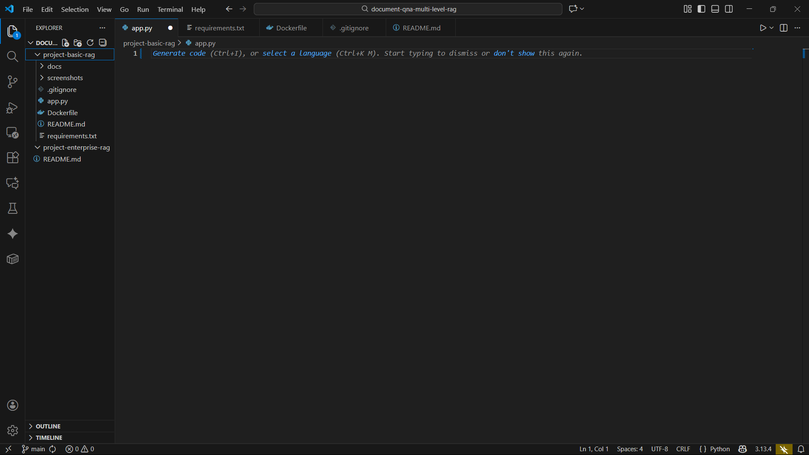
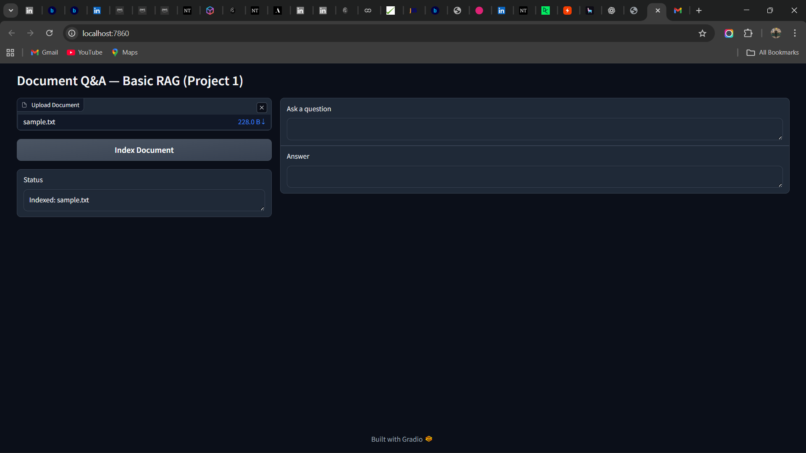
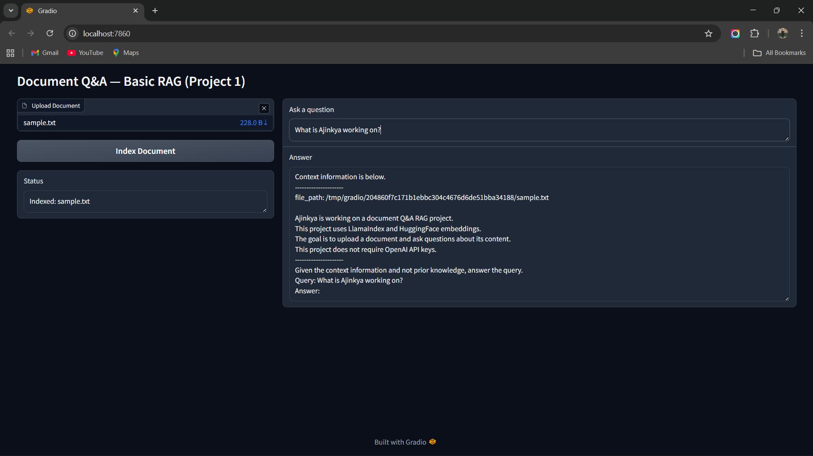

# 📄 Project 1 — Document Q&A System (Basic RAG with Local Embeddings)

<p>


</p>

---

## 📑 Table of Contents

- [Introduction](#introduction)
- [Architecture Diagram (Project 1)](#architecture-diagram-project-1)
- [Features](#features)
- [Project Structure](#project-structure)
- [Screenshots](#screenshots)
- [How to Run](#how-to-run)
- [How It Works](#how-it-works)
- [Purpose of This Project](#purpose-of-this-project)

---

## Introduction

This project is a **fully local** Document Question-Answering system using:

- **LlamaIndex**
- **HuggingFace local embedding models**
- **Gradio UI**
- **No external APIs**

It demonstrates a complete offline RAG workflow.

---

## Architecture Diagram (Project 1)


---

## Features

### 🔹 1. Local Embedding-Based Search  
Uses the **BAAI/bge-small-en-v1.5** embedding model from HuggingFace.

### 🔹 2. Document Indexing  
Documents are read via `SimpleDirectoryReader`, embedded, and stored in a `VectorStoreIndex`.

### 🔹 3. Interactive Gradio UI  
Allows users to:
- Upload a file  
- Index its content  
- Ask natural-language questions  
- View retrieved answers  

### 🔹 4. No LLM Required  
Pure retrieval-based answering, making it:
- Fast  
- Lightweight  
- Free  
- Private  

### 🔹 5. Dockerized  
Can be built and run anywhere:

docker build -t doc-qa-basic .
docker run -p 7860:7860 doc-qa-basic

## Project Structure
```
project-basic-rag/
│── app.py
│── Dockerfile
│── requirements.txt
│── README.md
│── docs/
│── screenshots/
│ │── 01-folder-structure.png
│ │── 02-index-document.png
│ │── 03-indexed-status.png
│ │── 04-query-and-answer.png
│ │── RAG_architecture.png
```

## Screenshots

| Step                       | Image |
|---------------------------|--------|
| 📁 **Project Structure**  |  |
| 📤 **Document Upload & Index** |  |
| 📌 **Index Confirmation** |  |
| ❓ **Query & Final Answer** |  |


## How to Run

### 1️⃣ Install Dependencies
pip install -r requirements.txt

2️⃣ Start the App
python app.py
Then open:

👉 http://localhost:7860

3️⃣ Run Using Docker
docker build -t doc-qa-basic .
docker run -p 7860:7860 doc-qa-basic


## How It Works
Upload Document → LlamaIndex reads the file

Embed Document → Convert text to vectors using BGE-small

Store in Vector Index → Enables similarity search

User Query → Query is embedded

Similarity Search → Retrieves best matching chunks

Answer Returned → Pure retrieval (no LLM used)

## Purpose of This Project
This project is designed to help to
Understand and implement RAG systems

Learn vector embeddings & similarity search

Build offline, private Q&A pipelines

Prepare for advanced RAG projects (metadata, reranking, hybrid retrieval)

Strengthen your AI/ML, Data Engineering, and GenAI portfolio

Ideal for a fresher showcasing real hands-on RAG experience.
